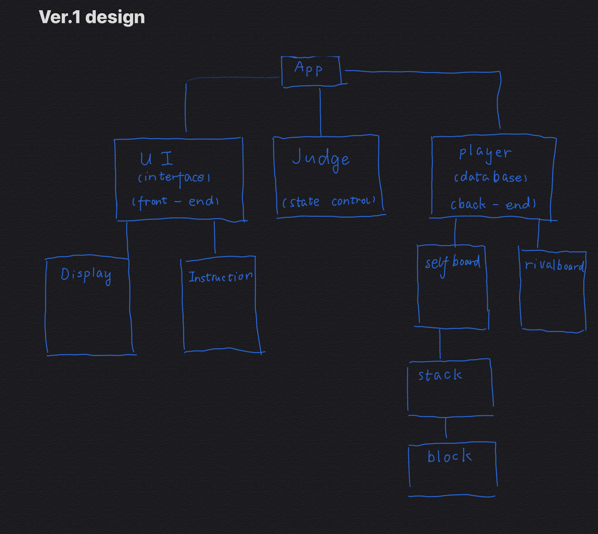
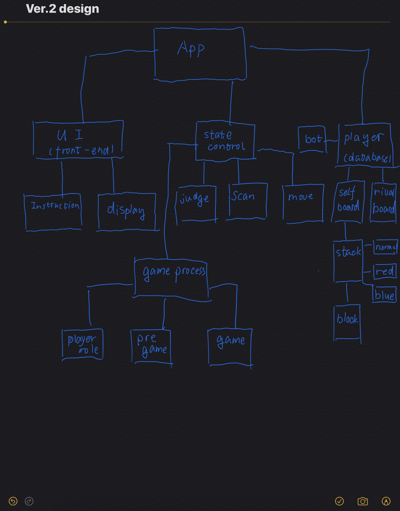

# Sally Stash

## instruction

to run game

```zsh
./gradlew run

```

to see code coverage, run
```
./gradlew cloverGenerateReport
```

then open the html page at
```
./build/reports/clover/html/pkg-summary.html
```
## version 1

### design

### commit id: **fa7f180fd694d435e7558b26f3dda8284b8dde67**
### commit comment: _version 1_

## version 2

### design

### commit id: **d365c27c86d9dd01f75f707b14f6b7d361bb0e19**
### commit comment: _version 2_


## reflections
a good design will save a lot of time on refactoring your code<br />   


the core of this design is data structure, a good hierarchy can make my life easier<br/> 

I also notice the importance of good setter & getter, in ver.1 there is no need of setter so I just don't write it. I realize that is a big mistake in ver.2<br/>

>with good data structure, then you can think about those design principles.<br/>

I find it hard to obey _LSP & open-closed_. sometimes new requirement comes up, I just have to add some features.<br/>

it is impossible to plan everything ahead, so you better think a lot of possble new features and leave some api, though your code looks redundant, but it will help you a lot in the future.<br/>

>however, I realize that dependency inversion is very helpful! try to rely on interface! 

In java, there is no function pointer, so I don't know how to do the dependency injection. maybe it is done with beans. If I do this under framework like _Spring_, my life would be better.<br/>


## test coverage
when i try to @test method that reads from inputstream "System.in"\
the gradle build will throw errors\
so I cannot provide full test coverage\
basically that is why I can't reach 100% coverage at that html report
